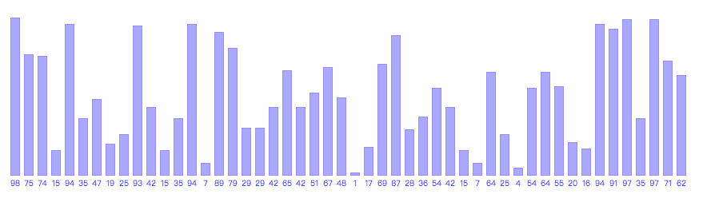

## 排序算法

排序介绍：

- 一旦我们将数据放置再某个数据结构（比如数组）中存储起来后，就可以根据需求对数据进行不同方式的排序
 - 比如对姓氏按照字母
 - 比如对商品按照价格排序
 - etc

排序算法又分为`简单排序`和`高级排序`。其中简单排序包括`冒泡排序、选择排序和插入排序`。高级排序包含`希尔排序、归併排序和快速排序`。

> :warning: 这裡仅仅介绍六种排序算法

下面我们逐个了解下：

### 冒泡排序

之所以叫做`冒泡排序`，是因为使用这种排序算法时，数据值就会像气泡那样从数组的一端漂浮到另一端。

假设正在将一组数据按照升序排列，较大的值会浮动在数组的右侧，而较小的值则会浮动到数组的左侧。产生这种冒泡的现象是因为算法会多次在数组中移动，比较相邻的数据，当左侧值大于右侧值得时候，将它们互换。

> 后面说到的排序算法如果没有额外说明，则默认为升序

比如下面的简单列表的例子。

`E A D B H`

经过第一次的排序之后，列表会变成：

`A E D B H`

前面两个元素进行了交换。接下来再次排序：

`A D E B H`

第二个元素和第三个元素进行了交换。继续进行排序：

`A D B E H`

第三个元素和第四个元素进行了交换。这一轮最后进行排序：

`A D B E H`

五个数据的位置没有发生变动。因为第四个元素比最后一个元素小，所以比较后保持各自所在的位置。反复对第一个元素执行上面的操作**（已经固定的值不参与排序，如第一轮固定的`H`不参与第二轮的比较了）**，得到的最终结果：

`A B D E H`

相关的动图如下：



关键代码如下：

```javascript
bubbleSort() {
  let numElements = this.arr.length;
  for(let outer = numElements-1; outer >= 2; --outer) {
    for(let inner = 0; inner <= outer-1; ++inner) {
      if(this.arr[inner] > this.arr[inner+1]) {
        this.swap(inner, inner+1); // 交换数组两个元素
      }
    }
  }
}
```

### 选择排序

`选择排序`从数组的开头开始，将第一个元素和其他元素进行比较。检查完所有的元素之后，最小的元素会被放在数组的第一个位置，然后算法会从第二个位置继续。这个过程进行到数组的倒数第二个位置时，所有的数据便完成了排序。

**原理：**

`选择排序`依然使用双层循环。外循环从数组的第一个元素移动到倒数第二个元素；内循环从`当前外循环指定元素的第二个元素`开始移动到最后一个元素，查找比当前外循环所指元素`小`的元素。每次循环迭代后，数组中最小的值都会被赋值到合适的位置。

下面是对五个元素的列表进行`选择排序`的简单例子。初始列表为：

`E A D H B`

第一次排序会找到最小值，并将它和列表的第一个元素进行交换位置：

`A E D H B`

接下来查找第一个元素后面的最小值**（第一个元素此时已经就位了）**，并对它们进行交换：

`A B D H E`

`D`已经就位了，因此下一步会对`E、H`进行交换，列表的顺序排列好，如下：

`A B D E H`

通过动图可能容易理解：


关键的代码如下：

```javascript
selectionSort() {
  let min,
    numElements = this.arr.length;
  for(let outer = 0; outer <= numElements-2; outer++) {
    min = outer;
    for(let inner = outer+1; inner <= numElements-1; inner++) {
      if(this.arr[inner] < this.arr[min]) {
        min = inner;
      }
    }
    this.swap(outer, min);
  }
}
```

### 插入排序

`插入排序`类似我们按照数字或字母的顺序对数据进行降序或者升序排序整理~

**原理：**

插入排序也用到了嵌套循环。外循环将数组挨个移动，而内循环则对外循环中选中的元素以及内循环数组后面的那个元素进行比较。如果外循环中选中的元素比内循环中选中的元素要小，那麽内循环的数组元素会向右移动，腾出一个外置给外循环选定的元素。

上面表达得令人晦涩难懂。**简单来说，插入排序就是未排序的元素对已经排序好的序列数据进行合适位置的插入。**如果还是难懂，结合下面的排序示例来理解下：

下面对五个元素进行插入排序。初始列表如下：

`E B A H D`

第一次插入排序，第二个元素会挪动到第一位：

`B E A H D`

第二次插入排序是对`A`进行操作：

`B A E H D`

`A B E H D`

第三次是对`H`进行操作，因为它比之前的元素都大，所以保持位置。最后一次是对`D`元素进行插入排序了，过程和最后结果如下：

`A B E D H`

`A B D E H`

结合相关的`GIF`图了解下：


相关的代码如下：

```javascript
insertionSort() {
  let temp,
    inner,
    numElements = this.arr.length;
  for(let outer = 1; outer <= numElements-1; outer++) {
    temp = this.arr[outer];
    inner = outer;
    while(inner > 0 && this.arr[inner-1] >= temp) {
      this.arr[inner] = this.arr[inner-1];
      inner--;
    }
    this.arr[inner] = temp;
  }
}
```

### 希尔排序

`希尔排序`是插入排序的优化版，但是，其核心理念和`插入排序`不同，希尔排序首先会比较距离较远的元素，而非相邻的元素。

**原理：**

希尔排序通过定义一个间隔序列来表示数据在排序过程中进行比较的元素之间有多远的间隔。`我们可以动态定义间隔序列，不过对于大部分的实际应用场景，算法用到的间隔序列可以提前定义好`。

如下演示希尔排序中，间隔序列是如何运行的：


结合下面的`GIF`图或许会有新的体会：


实现的代码如下：

```javascript
shellSort() {
  let temp,
    j,
    numElements = this.arr.length;
  for(let g = 0; g < this.gaps.length; ++g) {
    for(let i = this.gaps[g]; i < numElements; ++i) {
      temp = this.arr[i];
      for(j = i; j >= this.gaps[g] && this.arr[j - this.gaps[g]] > temp; j -= this.gaps[g]){ // 之前的已经排好序了
        this.arr[j] = this.arr[j - this.gaps[g]];
      }
      this.arr[j] = temp; // 这裡和上面的两个for循环是互换两个数据位置
    }
  }
}
```

> :confused: 思考：[6, 0, 2, 9, 3, 5, 8, 0, 5, 4] 间隔为3的排序结果是什麽呢？

### 归并排序

**原理：**

把一系列排好的子序列合併成一个大的有序序列。从理论上讲，这个算法很容易实现。我们需要两个排好序的子数组，然后通过比较数据的大小，从最小的数据开始插入，最后合併得到第三个数组。然而实际上操作数据量相当大的时候，使用归併排序示很耗内存的，我们这裡了解下就行了。


实现归併排序一般有两种方法，一种是**自顶向下**，另一种是**自底向上**。

上面的`GIF`图演示的是**自顶向下**的方法，那麽，何为自顶向下呢？

`自顶向下`的归併排序算法就是把数组元素不断的`二分`，直到数组的元素个数为一个，因为这个时候子数组必定是有序的，然后再将两个有序的序列合併成一个新的有序序列，又接著两个有序序列又可以合併成一个新的有序序列，以此类推，直到合併成一个有序的数组。如下图分解：


`自底向上`的归併排序算法的思想是将数组先一个一个归併成两两有序的序列，两两有序的序列归併成四个四个有序的序列，以此类推，直到归併的长度`大于`整个数组的长度，此时整个数组有序。

> :warning: 数组按照归併长度划分，最后一个子数组可能不满足长度要求，这种情况要特殊处理了。


### 快速排序

`快速排序`是处理大数据集最快的排序算法之一，**时间複杂度**最好的情况也是和归併排序一样，为`O(nlogn)`。

**原理：**

`快速排序`是一种**分而治之（分治）**的算法，通过递归的方式将数据依次分解为包含较小元素和较大元素的不同子序列，然后不断重複这个步骤，直到所有的数据都是有序的。

可以更清晰地表达`快速排序`算法的步骤如下：

1. 选择一个基准元素**（pivot，枢纽）**，将列表分隔为两个子序列
2. 对列表重新排列，将所有小于基准值的元素放在基准值的前面，将所有大于基准值的元素放在基准值的后面
3. 分别对较小元素的子序列和较大元素的子序列重複步骤`1和2`


我们来用代码实现下：

```javascript
// 快速排序
quickSort() {
  this.arr = this.quickAux(this.arr)
}

// aux函数 - 快排的辅助函数
quickAux(arr) {
  let numElements = arr.length；
  if(numElements === 0) {
    return []
  }
  let left = [],
    right = [],
    pivot = arr[0]; // 取数组的第一个元素作为基准值
  for(let i = 1; i < numElements; i++) {
    if(arr[i] < pivot) {
      left.push(arr[i]);
    } else {
      right.push(arr[i]);
    }
  }
  return this.quickAux(left).concat(pivot, this.quickAux(right));
}
```

以上介绍了六种排序的算法，当然还有很多其他的排序算法，你可以到[视屏 | 手撕九大经典排序算法，看我就够了!](https://zhuanlan.zhihu.com/p/52884590)文章中查看。