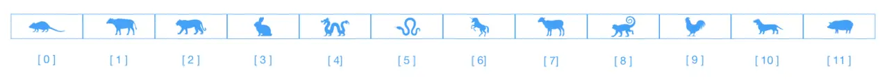

# 數組



數組是一種`線性結構`，以中國年生肖為例，其排序固定為`鼠、牛、虎、兔、龍、蛇、馬、羊、猴、雞、狗、豬`。

我們來創建一個數組並且打印下結果就清晰了：

```javascript
let arr = ['鼠', '牛', '虎', '兔', '龍', '蛇', '馬', '羊', '猴', '雞', '狗', '豬'];
arr.forEach((item, index) => {
	console.log(`[ ${index} ] => ${item}`);
});

// [ 0 ] => 鼠
// [ 1 ] => 牛
// [ 2 ] => 虎
// [ 3 ] => 兔
// [ 4 ] => 龍
// [ 5 ] => 蛇
// [ 6 ] => 馬
// [ 7 ] => 羊
// [ 8 ] => 猴
// [ 9 ] => 雞
// [ 10 ] => 狗
// [ 11 ] => 豬
```

> :warning: 啰嗦下：數組的下標是從 **0** 開始的

數組中常用的屬性和一些方法，直接調用即可。

## 常用屬性

- **length** 表示數組的長度

一般用做條件判斷，顯示或者隱藏某些內容。

## 常用方法

- **splice(index, howmany, item, ...itemx)**

`splice`方法自認為是數組中最強大的方法。可以實現數組的添加、刪除和替換。

- **indexOf(searchValue, formIndex)**

`indexOf`方法返回某個指定字符串在數組中的位置。`lastIndexOf`有異曲同工之妙，不過是從數組尾部開始搜索。

- **concat(array1, ...arrayn)**

`concat`方法用於連接兩個或以上的數組。

- **push(newElement1, ...newElementN)**

`push`方法可向**數組末尾**添加一個或者多個元素。

- **unshift(newElement1, ...newElementN)**

`unshift`方法可以向**數組開頭**添加一個或者多個元素。

- **pop()**

`pop`方法用於刪除並返回**數組中的最後一個元素**。

- **shift()**

`shift`方法用於刪除並返回**數組的第一個元素**。

- **reverse()**

`reverse`方法用於數組的反轉。

- **sort(sortFn)**

`sort`方法是對數組元素排序。參數`sortFn`可選，用於規定排序的順序（升序抑或降序），必須是函數。

```javascript
let values = [0, 1, 5, 10, 15]
values.sort()
console.log(values) // [0, 1, 10, 15, 5]

// ❓為什麼會出現這種排序結果呢？
// ❓不是默認是升序？
// 在忽略sortFn的情況下，元素會按照裝換為字符串的各個字符串的Unicode位點進行排序，如下
let equalValues = ['0', '1', '5', '10', '15']
equalValues.sort()
console.log(equalValues) //  ["0", "1", "10", "15", "5"]

// equalValues.sort()等同下面的代碼
let arr = [1, 0, 10, 15, 5]
const compare = (el1, el2) => el1 >= el2 ? 1 : -1 // 升序排列
arr.sort(compare)
console.log(arr) // [0, 1, 5, 10, 15]

// 再來個降序的操作
arr.sort((el1, el2) => el2 >= el1 ? 1 : -1) // 降序排序
console.log(arr); // [15, 10, 5, 1, 0]
```

- **forEach(fn(currentValue, index, arr), thisValue)**

`forEach`方法用於調用數組的每個元素，並將元素傳遞給回調函數。

- **every(fn(currentValue, index, arr), thisValue)**

`every`方法用於檢測數組中所有元素是否符合指定條件，如果數組中檢測到有一個元素不滿足，則整個表達式返回`false`，且剩餘的元素不再檢查。如果所有的元素都滿足條件，則返回`true`。

- **some(fn(currentValue, index, arr), thisValue)**

`some`方法用於檢測數組中元素是否滿足指定條件。只要有一個符合就返回`true`，剩餘的元素不再檢查。如果所有元素都不符合條件，則返回`false`。

- **reduce(fn(accumulator, currentValue, currentIndex, arr), initialValue)**

`reduce`方法接收一個函數作為累加器，數組中的每個值（從左往右）開始縮減，最終一個值。回調函數的四個參數的意義如下：`accumulator`必需，累加器累計回調的返回值，它是上一次上次調用時返回的累計值，或者`initialValue`；`currentValue`，必需，數組中正在處理的元素；`currentIndex`，可選，數組中正在處理的當前元素的索引，如果提供了`initialValue`，則索引號為0，否則為1；`arr`,可選，當前元素所屬的數組對象。`initialValue`，可選，傳遞給函數的初始值。

```javascript
let arr = [1, 2, 3, 4]
const reducer = (accumulator, currentValue) => accumulator + currentValue

// 1 + 2 + 3 + 4
console.log(arr.reduce(reducer)); // 10

// 5 + 1 + 2 + 3 + 4
console.log(arr.reduce(reducer, 5)); // 15
```

與數組相關的業務上使用這些屬性和方法，能夠`hold`住大多數業務了。