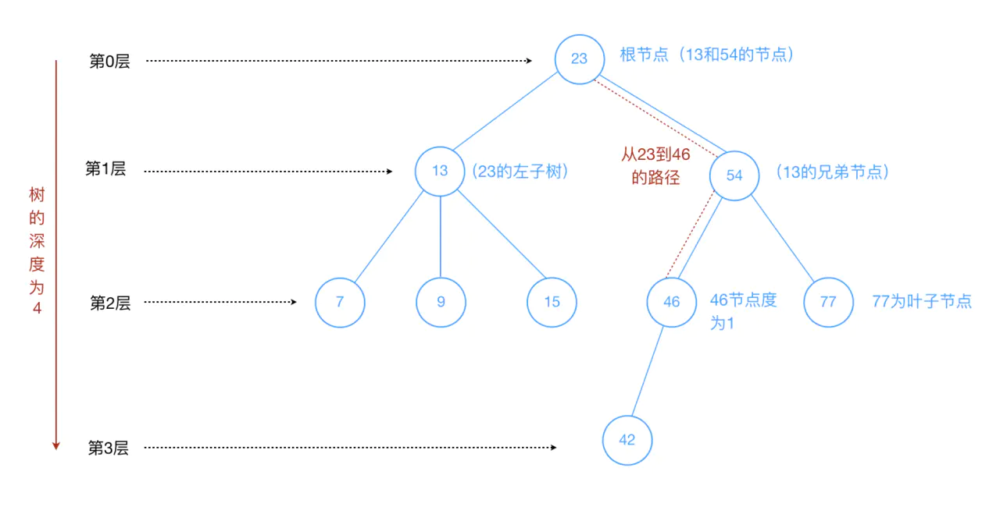
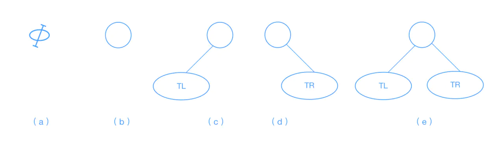
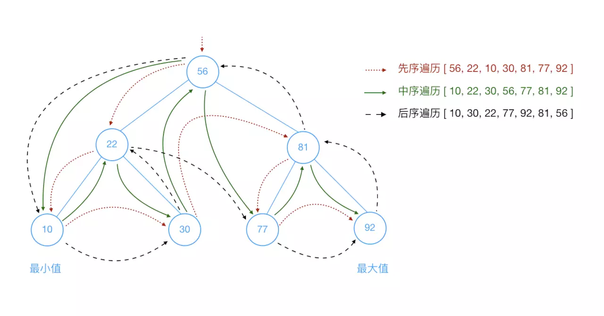
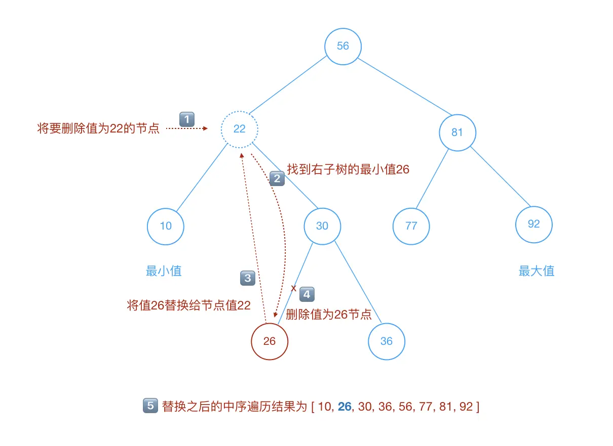

# 二叉查找樹



### 樹

- 樹的定義：
 - 樹（Tree）：`n(n >= 0)`個節點構成的有限集合。
  - 當`n = 0`時，稱為空樹；
  - 對任意一棵非空樹`(n > 0)`，具備以下性質：
  - 樹中有各一個稱為**根（Root）**的特殊節點，用`r(root)`表示；
  - 其餘節點可分為`m(m > 0)`個互不相交的有限集`T1, T2, ...Tm`，其中每個集合本身又是一棵樹，稱為原來樹的**子樹（SubTree）**

- 注意：
 - 子樹之間`不可以相交`
 - 除了根節點以外，每個節點有且僅有一個父節點；
 - 一個`N`個節點的樹有`N-1`條邊。

- 樹的術語：
 - 節點的度（Degree）：節點的子樹個數。
 - 樹的度：樹的所有節點中最大的度數（樹的度通常為節點個數的`N-1`）
 - 葉節點（Leaf）：度為`0`的節點（也稱為葉子節點）
 - 父節點（Parent）：有子樹的節點是其子樹的父節點
 - 子節點（Child）：若`A`節點是`B`節點的父節點，則稱`B`節點是`A`節點的子節點
 - 兄弟節點（Sibling）：具有同一個父節點的各節點彼此是兄弟節點
 - 路徑和路徑長度：從節點`n1`到`nk`的路徑為一個節點序列`n1,n2,n3,...,nk`，`ni`是`ni+1`的父節點。路徑所包含邊的個數為路徑的長度
 - 節點的層次（Level）：規定根節點在`第0層`，它的子節點是`第1層`，子節點的子節點是`第2層`，以此類推
 - 樹的深度（Depth）：樹中所有節點中的最大層次是這棵樹的深度`（因為上面是從0層開始，深度 = 第最大層數 + 1）`

> :warning: 類比我們的家族譜就很容易理解了

### 二叉樹

- 二叉樹的定義：
 - 二叉樹可以為空，也就是沒有節點
 - 二叉樹若不為空，則它是由根節點和稱為其左子樹`TL`和右子樹`RT`的兩個不相交的二叉樹組成
 - 二叉樹每個節點的子節點`不允許超過兩個`

- 二叉樹的五種形態
 - 空
 - 只有根節點
 - 只有左子樹
 - 只有右子樹
 - 左右子樹都有

對應下面的圖（從左到右）：



我們接下來要了解的是**二叉查找樹（BST, Binary Search Tree）**。二叉查找樹，也稱為`二叉搜索樹或二叉排序樹`，是一種特殊的二叉樹，相對值`小`的值保存在`左`節點中，`大`的值保存在`右`節點中。二叉查找樹特殊的結構使得它能夠快速地進行查找、插入和刪除數據。

用代碼實現理解下：

```javascript
// 輔助節點類
class Node {
  constructor(data, left, right){
    this.data = data;
    this.left = left;
    this.right = right;
  }
  // 展示節點信息
  show(){
    return this.data;
  }
}
class BST {
  constructor(){
      this.root = null;
  }
  // 插入數據
  insert(data){
    let n = new Node(data, null, null);
    if(this.root == null){
      this.root = n;
    }else{
      let current = this.root,
        parent = null;
      while(true){
        parent = current;
        if(data < current.data){
          current = current.left;
          if(current == null){
            parent.left = n;
            break;
          }
        }else{
          current = current.right;
          if(current == null){
            parent.right = n;
            break;
          }
        }
      }
    }
    return this;
  }
  // 中序遍歷
  inOrder(node){
    if(!(node == null)){
      this.inOrder(node.left);
      console.log(node.show());
      this.inOrder(node.right);
    }
  }
  // 先序遍歷
  preOrder(node){
    if(!(node == null)){
      console.log(node.show());
      this.preOrder(node.left);
      this.preOrder(node.right);
    }
  }
  // 後序遍歷
  postOrder(node){
    if(!(node == null)){
      this.postOrder(node.left);
      this.postOrder(node.right);
      console.log(node.show());
    }
  }
  // 獲取最小值
  getMin(){
    let current = this.root;
    while(!(current.left == null)){
      current = current.left;
    }
    return current.data;
  }
  // 獲取最大值
  getMax(){
    let current = this.root;
    while(!(current.right == null)){
      current = current.right;
    }
    return current.data;
  }
  // 查找給定的值
  find(data){
    let current = this.root;
    while(current != null){
      if(current.data == data){
        return current;
      }else if(data < current.data){
        current = current.left;
      }else{
        current = current.right;
      }
    }
    return null;
  }
  // 移除給定的值
  remove(data){
    root = this.removeNode(this.root, data);
    return this;
  }
  // 移除給定值得輔助函數
  removeNode(node, data){
    if(node == null){
      return null;
    }
    if(data == node.data){
      // 葉子節點
      if(node.left == null && node.right == null){
        return null; // 此節點置空
      }
      // 沒有左子樹
      if(node.left == null){
        return node.right;
      }
      // 沒有右子樹
      if(node.right == null){
        return node.left;
      }
      // 有兩個子節點的情況
      let tempNode = this.getSmallest(node.right); // 獲取右子樹
      node.data = tempNode.data; // 將其右子樹的最小值賦值給刪除的那個節點值
      node.right = this.removeNode(node.right, tempNode.data); // 刪除指定節點下的最小值，也就是將其置空
      return node;
    }else if(data < node.data){
      node.left = this.removeNode(node.left, data);
      return node;
    }else{
      node.right = this.removeNode(node.right, data);
      return node;
    }
  }
  // 獲取給定節點下的二叉樹最小值的輔助函數
  getSmallest(node){
    if(node.left == null){
      return node;
    }else{
      return this.getSmallest(node.left);
    }
  }
}

let bst = new BST();
bst.insert(56).insert(22).insert(10).insert(30).insert(81).insert(77).insert(92);
bst.inOrder(bst.root); // 10, 22, 30, 56, 77, 81, 92
console.log('--中序和先序遍歷分割線--');
bst.preOrder(bst.root); // 56, 22, 10, 30, 81, 77, 92
console.log('--先序和後序遍歷分割線--');
bst.postOrder(bst.root); // 10, 30, 22, 77, 92, 81, 56
console.log('--後序遍歷和獲取最小值分割線--');
console.log(bst.getMin()); // 10
console.log(bst.getMax()); // 92
console.log(bst.find(22)); // Node { data: 22, left: Node { data: 10, left: null, right: null }, right: Node { data: 30, left: null, right: null } }
// 我們刪除節點值為22，然後先序遍歷的方法遍歷，如下
console.log('--移除22的分割線--')
console.log(bst.remove(22).inOrder(bst.root)); // 10, 30, 56, 77, 81, 92
```

看了上面的代碼之後，你是否感覺有些懵圈呢？

我們借助幾張圖來了解下，或許你就豁然開朗了。

在遍歷的時候，我們分為三種遍歷方法 -- **先序遍歷，中序遍歷和後序遍歷**：



刪除節點是一個比較複雜的操作，考慮的情況比較多：

- 該節點沒有子節點的情況，直接將該節點置空
- 該節點只有左子樹的情況，直接將該節點賦予左子樹
- 該節點只有右子樹的情況，直接將該節點賦予右子樹
- 該節點左右子樹都有的情況，有兩種方法可以處理
 - 方案一：從待刪除節點的`左`子樹找到節點值`最大`的節點`A`，替換待刪除節點值，並刪除節點`A`
 - 方案二：從待刪除節點的`右`子樹找到節點值`最小`的節點`A`，替換待刪除節點值，並刪除節點`A`。`【上面代碼演示的刪除就是這種方案】`

刪除兩個節點的圖解`（方案二）`如下：

