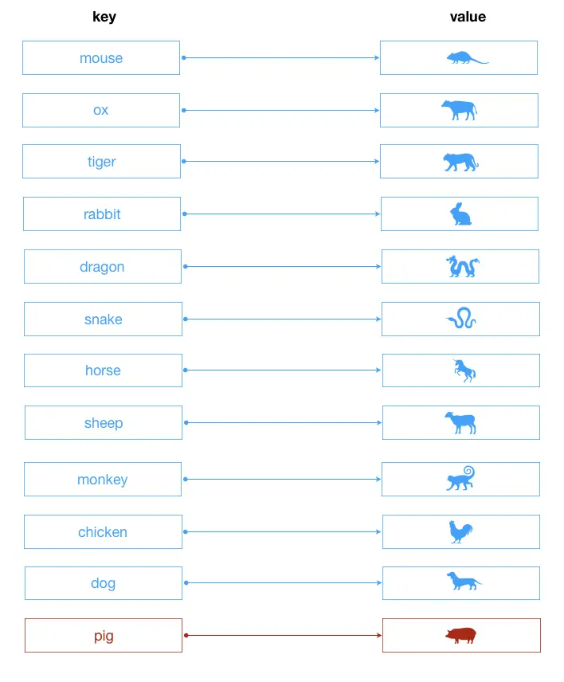

# 字典



**字典**的主要特點是鍵值對一一對應。可以比喻成我們現實學習中查的`中華字典`。這裡字典的鍵`(key)`理論上是可以使用任意的內容，但是還是建議語義化一點。比如上圖的十二生肖圖。

相關的演示代碼如下：

```javascript
class Dictionary {
  constructor(){
    this.items = {};
  }
  /**
  * @method set 設置鍵值對
  * @param { String } key 鍵
  * @param {*} value 值
  */
  set(key = '', value = ''){
    this.items[key] = value;
    return this;
  }
  /**
  * @method get 獲取某個值
  * @param { String } key 鍵
  */
  get(key = ''){
    return this.has(key) ? this.items[key] : undefined;
  }
  /**
  * @method has 判斷是否包含某個鍵的值
  * @param { String } key 鍵
  */
  has(key = ''){
    return this.items.hasOwnProperty(key);
  }
  /**
  * @method remove 移除元素
  * @param { String } key 
  */
  remove(key){
    if(!this.has(key))  return false;
    delete this.items[key];
    return true;
  }
  // 展示字典的鍵
  keys(){
    return Object.keys(this.items).join(' ');
  }
  // 字典的大小
  size(){
    return Object.keys(this.items).length;
  }
  // 展示字典的值
  values(){
    return Object.values(this.items).join(' ');
  }
  // 清空字典
  clear(){
    this.items = {};
    return this;
  }
}

let dictionary = new Dictionary(),
  arr = [{ key: 'mouse', value: '鼠'}, {key: 'ox', value: '牛'}, {key: 'tiger', value: '虎'}, {key: 'rabbit', value: '兔'}, {key: 'dragon', value: '龍'}, {key: 'snake', value: '蛇'}, {key: 'horse', value: '馬'}, {key: 'sheep', value: '羊'}, {key: 'monkey', value: '猴'}, {key: 'chicken', value: '雞'}, {key: 'dog', value: '狗'}, {key: 'pig', value: '豬'}];

  // 設置鍵值對
  arr.forEach(item => {
      dictionary.set(item.key, item.value);
  });

console.log(dictionary.keys()); // mouse ox tiger rabbit dragon snake horse sheep monkey chicken dog pig
console.log(dictionary.values()); // 鼠 牛 虎 兔 龍 蛇 馬 羊 猴 雞 狗 豬
console.log(dictionary.has('dragon')); // true
console.log(dictionary.get('tiger')); // 虎
console.log(dictionary.remove('pig')); // true
console.log(dictionary.size()); // 11
console.log(dictionary.clear().size()); // 0
```