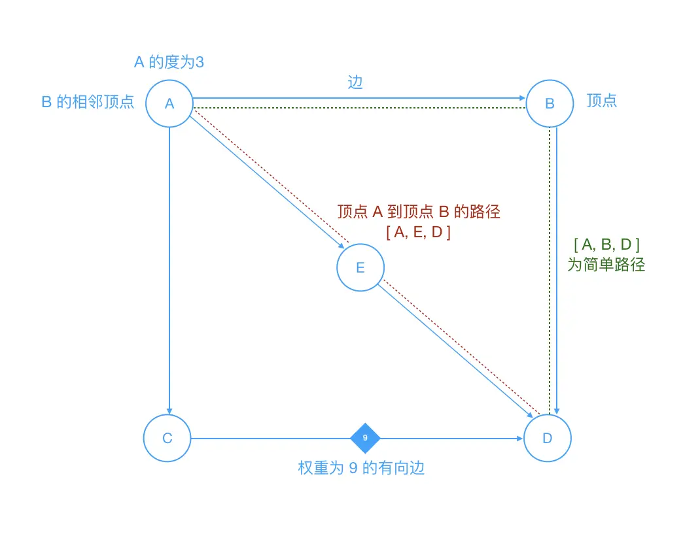
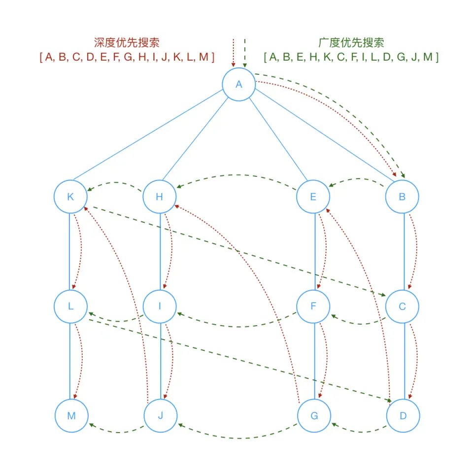

# 图



**图**由边的集合以及顶点的集合组成。

我们来了解下图的相关术语：

- 顶点：图中的一个节点
- 边：表示顶点和顶点之间的连线
- 相邻顶点：由一条边连接在一个的顶点称为相邻顶点
- 度：一个顶点的度是相邻顶点的数量。比如`0`顶点和其他两个顶点相连，`0`顶点的度就是`2`
- 路径：路径是顶点`v1,v2,...,vn`的一个连续序列
 - 简单路径：简单路径要求不包含重複的顶点
 - 迴路：第一个顶点和最后一个顶点相同的路径称为迴路
- 有向图和无向图
 - 有向图表示图中的`边`是`有`方向的
 - 无向图表示图中的`边`是`无`方向的 
- 带权图和无权图
 - 带权图表示图中的`边`是`有`权重的
 - 无权图表示图中的`边`是`无`权重的

图可以用于现实中的很多系统建模，比如：

- 对交通限流建模
 - 顶点可以表示街道的十字路口，边表示街道
 - 加权的边可以表示限速或者车道的数量或街道的距离
 - 建模人员可以用这个系统来判定最佳路线以及可能拥堵的街道

我们用代码来加深理解：

```javascript
class Graph{
  constructor(v){
    this.vertices = v; // 顶点个数
    this.edges = 0; // 边的个数
    this.adj = []; // 邻接表或邻接数组
    this.marked = []; // c存储顶点是否被访问过的标识
    this.init();
  }
  init(){
    for(let i = 0; i < this.vertices; i++){
      this.adj[i] = [];
      this.marked[i] = false;
    }
  }
  // 添加边
  addEdge(v, w){
    this.adj[v].push(w);
    this.adj[w].push(v);
    this.edges++;
    return this;
  }
  // 展示图
  showGraph(){
    for(let i = 0; i < this.vertices; i++){
      for(let j = 0; j < this.vertices; j++){
        if(this.adj[i][j] != undefined){
          console.log(i +' => ' + this.adj[i][j]);
        }
      }
    }
  }
  // 深度优先搜索
  dfs(v){
    this.marked[v] = true;
    if(this.adj[v] != undefined){
      console.log("visited vertex: " + v);
    }
    this.adj[v].forEach(w => {
      if(!this.marked[w]){
        this.dfs(w);
      }
    })
  }
  // 广度优先搜索
  bfs(v){
    let queue = [];
    this.marked[v] = true;
    queue.push(v); // 添加到队尾
    while(queue.length > 0){
      let v = queue.shift(); // 从队首移除
      if(v != undefined){
        console.log("visited vertex: " + v);
      }
      this.adj[v].forEach(w => {
        if(!this.marked[w]){
          this.marked[w] = true;
          queue.push(w);
        }
      })
    }
  }
}

let graphFirstInstance = new Graph(5)
graphFirstInstance.addEdge(0, 1).addEdge(0, 2).addEdge(1, 3).addEdge(2, 4)
graphFirstInstance.showGraph()
// 0 => 1
// 0 => 2
// 1 => 0
// 1 => 3
// 2 => 0
// 2 => 4
// 3 => 1
// 4 => 2
// ❓为什麽会被出现这种数据呢？它对应的图是什麽呢？可以思考🤔下，动手画画图什麽的
console.log('--展示图和深度优先搜索的分割图--')
graphFirstInstance.dfs(0); // 从顶点 0 开始的深度搜索
// visited vertex: 0
// visited vertex: 1
// visited vertex: 3
// visited vertex: 2
// visited vertex: 4
console.log('--深度优先搜索和广度优先搜索的分割线--')
let graphSecondInstance = new Graph(5)
graphSecondInstance.addEdge(0, 1).addEdge(0, 2).addEdge(1, 3).addEdge(2, 4)
graphSecondInstance.bfs(0) // 从顶点 0 开始的广度搜索
// visited vertex: 0
// visited vertex: 1
// visited vertex: 2
// visited vertex: 3
// visited vertex: 4
```

对于搜索图，在上面我们介绍了**深度优先搜索 - DFS（Depth First Search）和广度优先搜索 - BFS（Breadth First Search）**，结合下面的图再回头看下上面的代码，你会更加容易理解这两种搜索图的方式。



