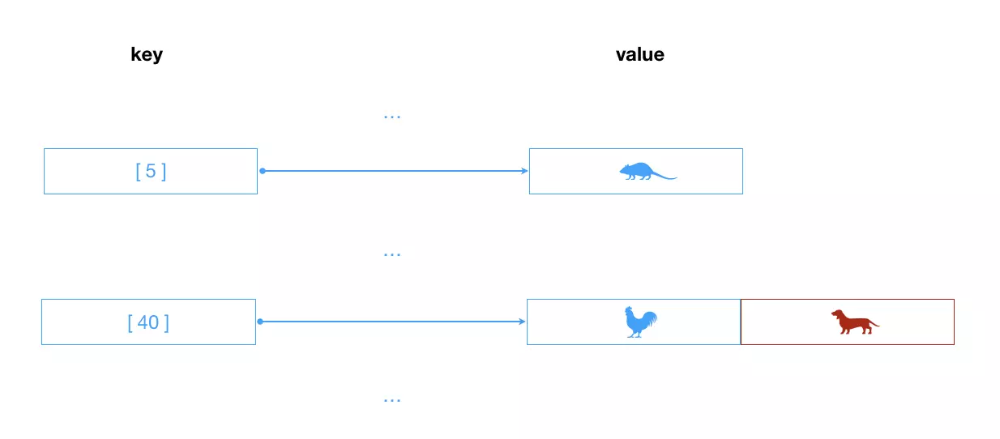

# 散列表/哈希表


散列是一种常用的存储技术，散列使用的数据结构叫做**散列表/哈希表**。在散列表上`插入、删除和取用`数据非常快，但是对于`查找`操作来说却效率低下，比如查找一组数据中的最大值和最小值。查找的操作得求助其他的数据结构，比如下面提到的**二叉树**。

切入一个案例来感受下哈希表：

**加入一家公司有1000个员工，现在我们需要把这些员工的信息使用某种数据结构来保存起来。你会採用什么数据结构呢？**

- 方案一：数组
 - 按照顺序将所有的员工信息依次存入一个长度为`1000`的数组中。每个员工的信息都保存在改数组的某个位置上。
 - 但是我们要查看某个员工的信息怎么办？一个个查找吗？太好找。
 - 数组最大的优势是什么？通过下标获取信息。
 - 所以为了可以通过数组快速定位到某个员工，最好给员工信息添加一个员工编号，而`编号`对应的就是员工的`下标值index`。
 - 当查找某个员工信息时，通过员工号可以快速定位到员工的信息位置。

- 方案二：链錶
 - 链錶对插入和删除数据有一定的优势
 - 但是对于获取员工的信息，每次都必须从头遍历到尾，这种方式显然不是特别适合我们这种场景。

- 最终方案
 - 这么看来，最终方案似乎就是数组了，但是数组还是有缺点，什么呢？
 - 假如我们想查看下张三这位员工的信息，但是我们不知道张三的员工编号，怎么办？
 - 当然，我们可以问他的员工编号。但是我们没查一个员工都要问下员工的编号吗？不合适`【PS：那我们还不如直接问他的信息得了】`
 - 能不能有一种方法，让张三的名字和他的员工编号产生直接的关係呢？
 - 也就是通过张三这个名字，我们就能获取到他的索引值，然后再通过索引值就能获取张三的信息呢？
 - 这样的方案已经存在了，就是使用**哈希函数**，让某个`key`的信息和索引值对应起来。

那么，下面了解下散列表的原理和实现。

我们下面的散列表是基于数组完成的，我们从数组这裡切入解析下。`数组可以通过下标直接定位到相应的空间`，哈希表的做法就是类似的实现。哈希表把`(key)键`通过一个固定的算法函数（此函数称为哈希函数/散列函数）转换成一个整型数字，然后就将该数字对数组长度进行**取馀**,取馀结果就当做数组的下标，将`(value)值`存储在改数字为下标的数组空间裡，而当使用哈希表进行查询的时候，就再次使用哈希函数将`key`转换为对应的数组下标，并定位到改空间获取`value`。

结合下面的代码，我们会更加容易理解：

```javascript
class HashTable {
  constructor(){
    this.table = new Array(137);
  }
  /**
  * @method hashFn 哈希函数
  * @param { String } data 传入的字符串
  * @return { Number } 返回取馀数字
  */
  hashFn(data){
    let total = 0;
    for(let i = 0; i < data.length; i++){
      total += data.charCodeAt(i);
    }
    return total % this.table.length;
  }
  /**
  * 
  * @param { String } data 传入字符串
  */
  put(data){
    let pos = this.hashFn(data);
    this.table[pos] = data;
    return this;
  }
  // 展示
  show(){
    this.table && this.table.forEach((item, index) => {
      if(item != undefined){
        console.log(index + ' => ' + item);
      }
    })
  }
  // ...获取值get函数等，看官感兴趣的话自己补充测试下啦
}

let hashtable = new HashTable(),
  arr = ['mouse', 'ox', 'tiger', 'rabbit', 'dragon', 'snake', 'horse', 'sheep', 'monkey', 'chicken', 'dog', 'pig'];
arr.forEach(item => {
  hashtable.put(item);
});
hashtable.show();
// 5 => mouse
// 40 => dog
// 46 => pig
// 80 => rabbit
// 87 => dragon
// 94 => ox
// 111 => monkey
// 119 => snake
// 122 => sheep
// 128 => tiger
// 134 => horse

// 那么问题来了，十二生肖裡面的_小鸡_去哪裡了呢❓
// 被_小狗_给覆盖了，因为其位置也是40（这个可以自己证明下）
// 问题又来了，那么应该如何解决这种被覆盖的冲突呢❓
```

针对上面的问题，我们存储数据的时候，产生衝突的话，可以像下面这样解决：

**1. 线性探测法**

当发生`碰撞（冲突）`时，线性探测法检测散列表中的下一个位置`【有可能是非顺序查找位置，不一定是下一个位置】`是否为空。如果为空，就将数据存入该位置；如果不为空，则继续检查下一个位置，直到找到下一个空的位置为止。该技术是基于一个事实：**每个散列表都有很多空的单元格，可以使用它们来存储数据。**

**2. 开链法**

当发生`碰撞（冲突）`时，我们仍然希望将`key（键）`存储到通过哈希函数产生的索引位置上，那么我们可以使用**开链法**。**开链法**是指实现哈希表底层的数组中，每个数组元素又是一个新的数据结构，比如是另一个数组`（这样结合起来就是二维数组了）`,链表等，这样就能存储多个键了。使用这种技术，即使两个`key（键）`散列后的值相同，依然是被保存在相同的位置，只不过它们是被保存在另一个数据结构上而已。以另一个数据结构是数组为例，存储的数据如下：




