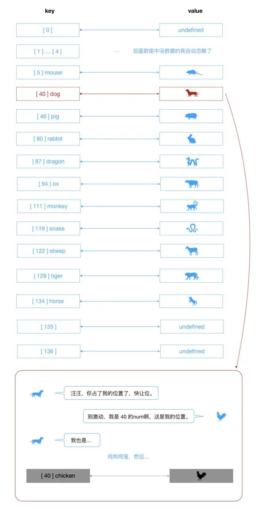

# 散列表/哈希表

散列是一種常用的存儲技術，散列使用的數據結構叫做**散列表/哈希表**。在散列表上`插入、刪除和取用`數據非常快，但是對於`查找`操作來說卻效率低下，比如查找一組數據中的最大值和最小值。查找的操作得求助其他的數據結構，比如下面提到的**二叉樹**。

切入一個案例來感受下哈希表：

**加入一家公司有1000個員工，現在我們需要把這些員工的信息使用某種數據結構來保存起來。你會採用什麼數據結構呢？**

- 方案一：數組
 - 按照順序將所有的員工信息依次存入一個長度為`1000`的數組中。每個員工的信息都保存在改數組的某個位置上。
 - 但是我們要查看某個員工的信息怎麼辦？一個個查找嗎？太好找。
 - 數組最大的優勢是什麼？通過下標獲取信息。
 - 所以為了可以通過數組快速定位到某個員工，最好給員工信息添加一個員工編號，而`編號`對應的就是員工的`下標值index`。
 - 當查找某個員工信息時，通過員工號可以快速定位到員工的信息位置。

- 方案二：鏈錶
 - 鏈錶對插入和刪除數據有一定的優勢
 - 但是對於獲取員工的信息，每次都必須從頭遍歷到尾，這種方式顯然不是特別適合我們這種場景。

- 最終方案
 - 這麼看來，最終方案似乎就是數組了，但是數組還是有缺點，什麼呢？
 - 假如我們想查看下張三這位員工的信息，但是我們不知道張三的員工編號，怎麼辦？
 - 當然，我們可以問他的員工編號。但是我們沒查一個員工都要問下員工的編號嗎？不合適`【PS：那我們還不如直接問他的信息得了】`
 - 能不能有一種方法，讓張三的名字和他的員工編號產生直接的關係呢？
 - 也就是通過張三這個名字，我們就能獲取到他的索引值，然後再通過索引值就能獲取張三的信息呢？
 - 這樣的方案已經存在了，就是使用**哈希函數**，讓某個`key`的信息和索引值對應起來。

那麼，