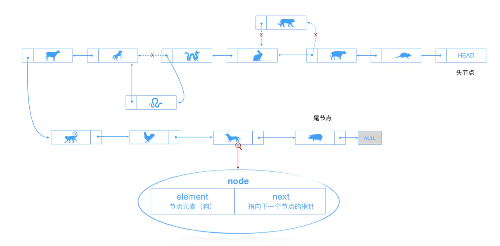

# 鏈錶



在進入正題之前，我們先來聊聊數組的優缺點。

### 優點

- 存儲多個元素，比較常用

- 訪問便捷，使用下標`[index]`即可訪問

### 缺點

- 數組的創建通常需要申請一段連續的內存空間，並且大小是固定的`（大多數的編程語言數組都是固定的）`，所以在進行擴容的時候難以掌控。`(一般情況下，申請一個更大的數組，會是之前數組的倍數，比如兩倍。然後，再將數組中的元素複製過去)`

- 插入數據越是靠前，其成本越高，因為需要進行大量元素的位移。

相對數組，**鏈錶**也可以存儲多個元素，而且存儲的元素在內容中不必是連續的空間；在插入和刪除數據時，`時間複雜度`可以達到`O(1)`。在查找元素的時候，還是需要從頭開始遍歷的，比數組在知道下標的情況下要快，但是數組如果不確定下標的話，那就另說了...

**鏈錶**是由一組節點組成的集合。每個節點都使用一個對象的引用指向它的後繼。

我們還是使用十二生肖來了解：

```javascript
// 鏈錶
class Node {
  constructor(element){
    this.element = element;
    this.next = null;
  }
}

class LinkedList {
  constructor(){
    this.length = 0; // 鏈錶長度
    this.head = new Node('head'); // 表頭節點
  }
  /**
  * @method find 查找元素
  * @param { String } item 要查找的元素
  * @return { Object } 返回查找到的節點，找不到的情況下直接返回鏈尾節點
  */
  find(item = ''){
    let currNode = this.head;
    while(currNode.element != item && currNode.next){
      currNode = currNode.next;
    }
    return currNode;
  }
  /**
  * @method findPrevious 查找鏈錶指定元素的前一個節點
  * @param { String } item 指定元素
  * @return { Object } 返回查找到的元素的前一個節點，找不到的情況下直接返回鏈尾節點
  */
  findPrevious(item){
    let currNode = this.head;
    while((currNode.next != null) && (currNode.next.element != item)){
      currNode = currNode.next;
    }
    return currNode;
  }
  /**
  * @method insert 插入元素
  * @param { String } newElement 要插入的元素
  * @param { String } item 想要追加在後面的元素（此元素不一定存在）
  */
  insert(newElement = '', item){
    if(!newElement) return;
    let newNode = new Node(newElement),
      currNode = this.find(item);
    newNode.next = currNode.next;
    currNode.next = newNode;
    this.length++;
    return this;
  }
  // 打印
  display(){
    let currNode = this.head,
      arr = [];
    while(currNode.next != null){
      arr.push(currNode.next.element);
      currNode = currNode.next;
    }
    return arr.join(' ');
  }
  // 鏈錶長度
  size(){
    return this.length;
  }
  // 鏈錶是否為空
  isEmpty(){
    return this.length == 0;
  }
  /**
  * @method indexOf 查看鏈錶中元素的索引
  * @param { String } element 要查找的元素
  */
  indexOf(element){
    let currNode = this.head,
      index = 0;
    while(currNode.next != null){
      index++;
      if(currNode.next.element == element){
        return index;
      }
      currNode = currNode.next;
    }
    return -1;
  }
  /**
  * @method removeEl 移除指定元素
  * @param { String } element 
  */
  removeEl(element){
    let preNode = this.findPrevious(element);
    preNode.next = preNode.next != null ? preNode.next.next : null;
  }
}

let linkedlist = new LinkedList();
console.log(linkedlist.isEmpty()); // true
linkedlist.insert('鼠').insert('虎').insert('牛', '鼠');
console.log(linkedlist.display()); // 鼠 牛 虎
console.log(linkedlist.find('豬')); // Node { element: '虎', next: null }
console.log(linkedlist.find('鼠')); // Node { element: '鼠', next: Node { element: '牛', next: Node { element: '虎', next: null } } }
console.log(linkedlist.size()); // 3
console.log(linkedlist.indexOf('鼠')); // 1
console.log(linkedlist.indexOf('豬')); // -1
console.log(linkedlist.findPrevious('虎')); // Node { element: '牛', next: Node { element: '虎', next: null } }
linkedlist.removeEl('鼠');
console.log(linkedlist.display()); // 牛 虎
```