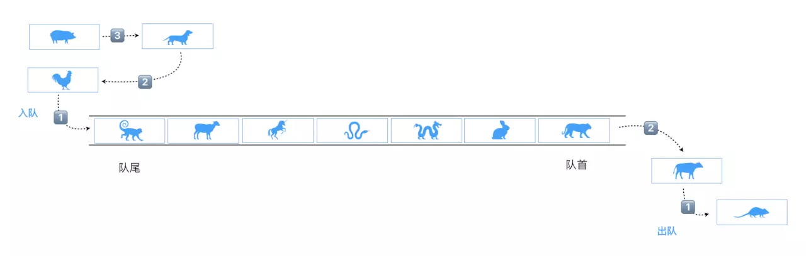

# 隊列



**隊列**是一種先進先出(FIFO)受限的線性表。受限體現於其允許在表的前端（front，隊首）進行刪除操作，在表的末尾（rear，隊尾）進行插入操作。

> :warning: 優先隊列等操作可不在隊首和隊尾操作。

代碼演示如下：

```javascript
class Queue {
  constructor(){
    this.items = [];
  }
  // 入隊
  enqueue(element = ''){
    if(!element) return;
    this.items.push(element);
    return this;
  }
  // 出隊
  dequeue(){
    this.items.shift();
    return this;
  }
  // 隊首元素
  front(){
    return this.items[0];
  }
  // 是否空隊
  isEmpty(){
    return this.items.length == 0;
  }
  // 隊列長度
  len(){
    return this.items.length;
  }
  // 打印
  print(){
    return this.items.join(' ');
  }
}

let queue = new Queue(),
  arr = ['鼠', '牛', '虎', '兔', '龍', '蛇', '馬', '羊', '猴', '雞', '狗', '豬'];
arr.forEach(item => {
  queue.enqueue(item);
});

console.log(queue.print()); // 鼠 牛 虎 兔 龍 蛇 馬 羊 猴 雞 狗 豬
console.log(queue.isEmpty()); // false
console.log(queue.len()); // 12

queue.dequeue().dequeue();
console.log(queue.front()); // 虎
console.log(queue.print()); // 虎 兔 龍 蛇 馬 羊 猴 雞 狗 豬
```