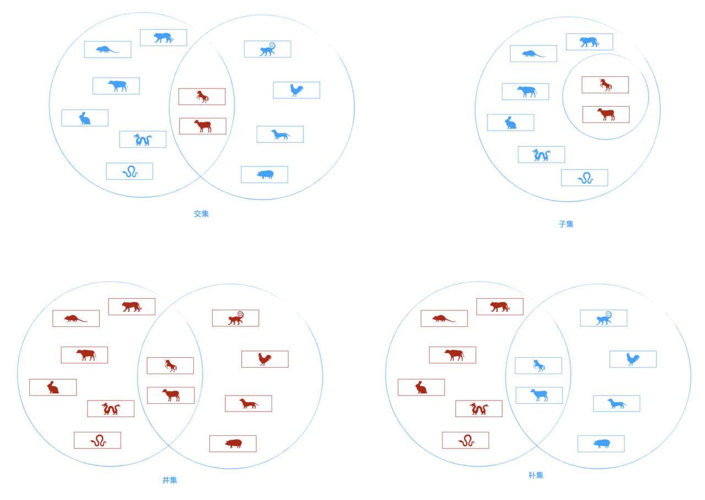

# 集合



**集合**通常是一組無序的，不能重複的元素構成。一些常見的集合操作有`交集、子集、並集和補集`。

`es6`中已經封裝好了可用的[Set類](http://es6.ruanyifeng.com/#docs/set-map)。下面，我們來動手寫下相關的邏輯。

```javascript
class Set {
  constructor(){
    this.items = [];
  }
  /**
  * @method add 添加元素
  * @param { String } element 
  * @return { Boolean }
  */
  add(element = ''){
    if(this.items.indexOf(element) >= 0) return false;
    this.items.push(element);
    return true;
  }
  // 集合的大小
  size(){
    return this.items.length;
  }
  // 集合是否包含指定的元素
  has(element = ''){
    return this.items.indexOf(element) >= 0;
  }
  // 展示集合
  show(){
    return this.items.join(' ');
  }
  // 移除某個元素
  remove(element){
    let pos = this.items.indexOf(element);
    if(pos < 0) return false;
    this.items.splice(pos, 1);
    return true;
  }
  /**
  * @method union 並集
  * @param { Array } set 數組集合
  * @return { Object } 返回並集的對象
  */
  union(set = []){
    let tempSet = new Set();
    for(let i = 0; i < this.items.length; i++){
      tempSet.add(this.items[i]);
    }
    for(let i = 0; i < set.items.length; i++){
      if(tempSet.has(set.items[i])) continue;
      tempSet.items.push(set.items[i]);
    }
    return tempSet;
  }
  /**
  * @method intersect 交集
  * @param { Array } set 數組集合
  * @return { Object } 返回交集對象
  */
  intersect(set = []){
    let tempSet = new Set();
    for(let i = 0; i < this.items.length; i++){
      if(set.has(this.items[i])){
        tempSet.add(this.items[i]);
      }
    }
    return tempSet;
  }
  /**
  * @method isSubsetOf 【A】是【B】的子集？
  * @param { Array } set 數組集合
  * @return { Boolean } 真假值
  */
  isSubsetOf(set = []){
    if(this.size() > set.size()) return false;
    this.items.forEach*(item => {
      if(!set.has(item)) return false;
    });
    return true;
  }
}

let set = new Set(),
  arr = ['鼠', '牛', '虎', '兔', '龍', '蛇', '馬', '羊', '猴'];
arr.forEach(item => {
  set.add(item);
});
console.log(set.show()); // 鼠 牛 虎 兔 龍 蛇 馬 羊 猴
console.log(set.has('豬')); // false
console.log(set.size()); // 9
set.remove('鼠');
console.log(set.show()); // 牛 虎 兔 龍 蛇 馬 羊 猴

let setAnother = new Set(),
  anotherArr = ['馬', '羊', '猴', '雞', '狗', '豬'];
anotherArr.forEach(item => {
  setAnother.add(item);
});
console.log(set.union(setAnother).show()); // 牛 虎 兔 龍 蛇 馬 羊 猴 雞 狗 豬
console.log(set.intersect(setAnother).show()); // 馬 羊 猴
console.log(set.isSubsetOf(setAnother)); // false
```
