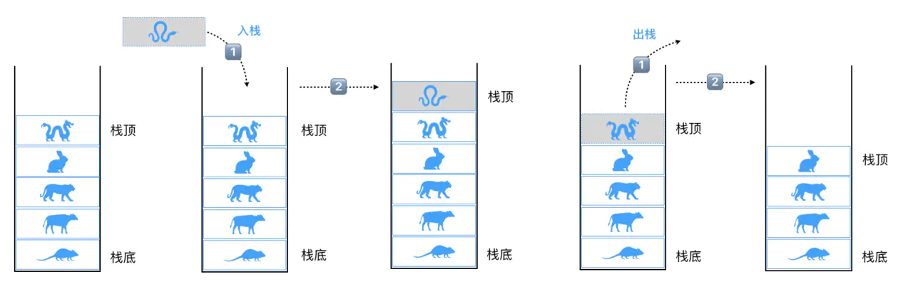

# 棧



棧是一種後進先出(LIFO)線性表，是一種基於數組的數據結構。

- **LIFO(Last In First Out)**表示後進先出，後進來的元素第一個被彈出棧空間。類似於自動餐托盤，最後放上去的托盤，往往先被拿出來使用。

- 僅允許在表的一端插入和移除數據。這一端被稱為**棧頂**，相對地，把另一端稱為**棧底**。

- 向一個棧插入新數據稱為**進棧、入棧或壓棧**，這是將新元素放在棧頂元素上面，使之成為新的棧頂元素。

- 從一個棧刪除元素又稱為**出棧或退棧**，它是把棧頂元素刪除掉，使其相鄰的元素成為新的棧頂元素。

代碼操作熟悉下：

```javascript
class Stack {
  constructor(){
    this.items = [];
  }
  // 入棧操作
  push(element = ''){
    if(!element) return;
    this.items.push(element);
    return this;
  }
  // 出棧操作
  pop(){
    this.items.pop();
    return this;
  }
  // 棧頂元素
  peek(){
    return this.items[this.size() - 1];
  }
  // 輸出
  print(){
    return this.items.join(' ');
  }
  // 是否空棧
  isEmpty(){
    return this.items.length == 0;
  }
  // 棧的大小
  size(){
    return this.items.length;
  }
}

let stack = new Stack(),
  arr = ['鼠', '牛', '虎', '兔', '龍', '蛇', '馬', '羊', '猴', '雞', '狗', '豬'];
arr.forEach(item => {
  stack.push(item);
});

console.log(stack.print()); // 鼠 牛 虎 兔 龍 蛇 馬 羊 猴 雞 狗 豬
console.log(stack.peek()); // 豬

stack.pop().pop().pop().pop();
console.log(stack.print()); // 鼠 牛 虎 兔 龍 蛇 馬 羊
console.log(stack.isEmpty()); // false
console.log(stack.size()); // 8
```

> :warning: 棧這裡的`push`和`pop`方法要和數組裡面的`push`和`pop`方法區分下。

